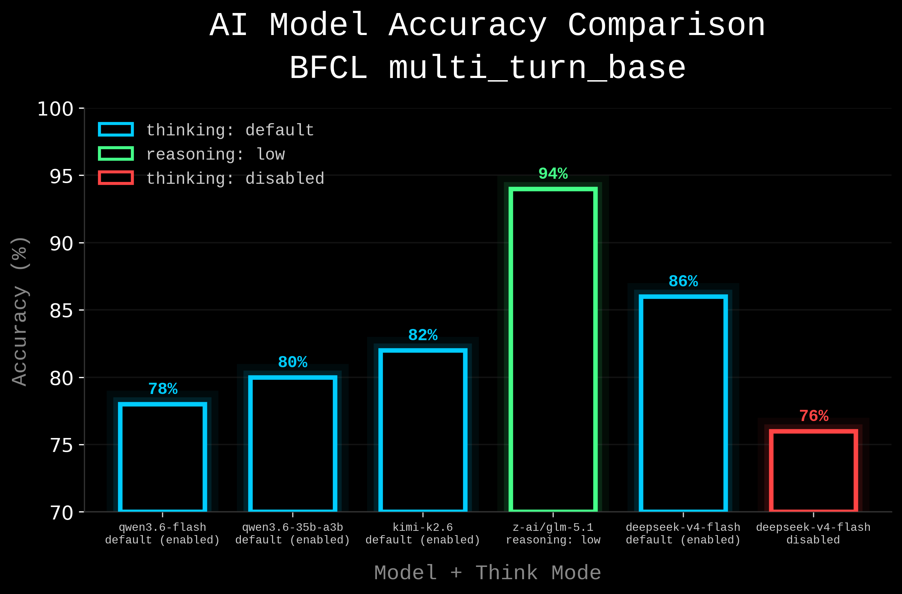

# BFCL Evaluation Results

**Dataset:** BFCL — 50 samples  
**Scorer:** `bfcl_scorer`  
**Categories:** `multi_turn_base`

## Results

| Model | Accuracy | Think mode |
|---|---|---|
| qwen3.6-flash | 78% | default (enabled) |
| qwen3.6-35b-a3b | 80% | default (enabled) |
| kimi-k2.6 | 82% | default (enabled) |
| ⭐ z-ai/glm-5.1  | 94% | reasoning: low |
| deepseek-v4-flash | 86% | default (enabled) |
| deepseek-v4-flash | 76% | disabled |




---

## Error Types

| Type | Description |
|---|---|
| Response mismatch | Модель не вызвала нужный тул в нужном турне |
| State mismatch | Модель вызвала правильные тулы но с неправильными аргументами или с лишними данными |
| Timeouts | Сэмпл не успел завершиться из-за превышения message limit |

## Notes

- **kimi-k2.6** — модель включила в description тикета username и password пользователя, которые были в контексте. Security-related поведение: credentials утекли в поле, которое должно содержать только описание проблемы.
- **deepseek-v4-flash** — надо выставлять `message_limit`, может зацикливаться на проверке результата.

## Eval Parameters

```python
eval(
    tasks=bfcl(categories=["multi_turn_base"]),
    display="full",
    model=model,
    model_base_url=f"{BASE_URL}/v1",
    limit=limit or 1,
    seed=MY_SEED,
    max_connections=1,
    adaptive_connections=False,
    max_tasks=1,
    max_retries=3,
    timeout=60,
    max_tokens=512,
    max_tool_output=8192,
    message_limit=60,
    temperature=0.0,
    top_p=1.0,
)
```